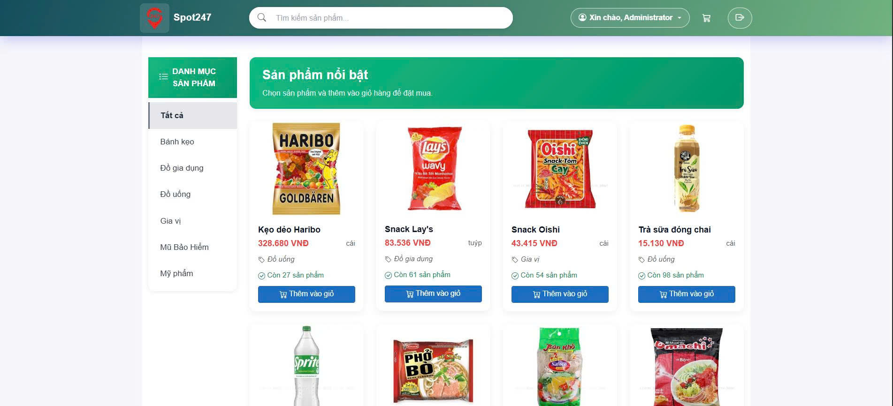
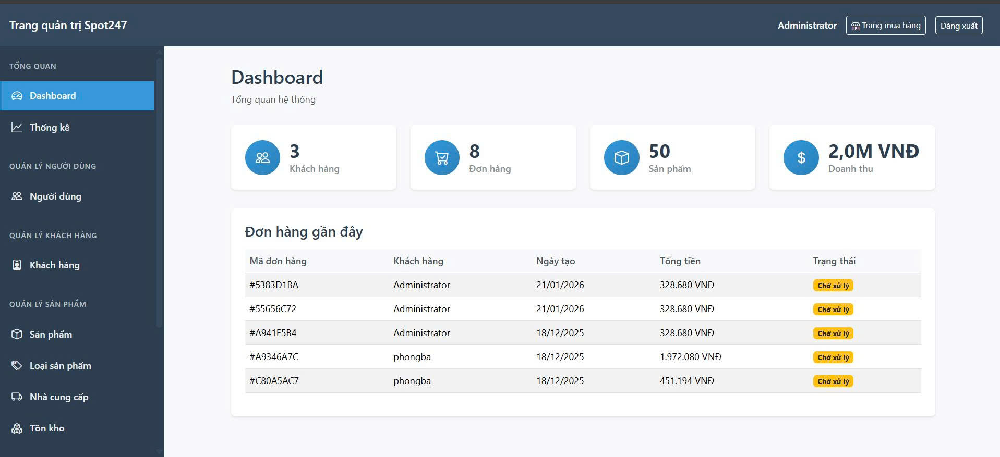

# 🏬 Store Management System

## 🎯 1. Mục tiêu dự án
Xây dựng ứng dụng **quản lý cửa hàng** với các thành phần chính:

- 🧭 **Frontend:** Giao diện người dùng chạy trực tiếp trên trình duyệt bằng **Blazor WebAssembly (WASM)**.  
- ⚙️ **Backend:** Cung cấp API và xử lý nghiệp vụ bằng **ASP.NET Core MVC / Web API**.  
- 💾 **Cơ sở dữ liệu:** Sử dụng **MySQL**, được quản lý thông qua **Laragon**.  

Ứng dụng cho phép quản lý dữ liệu như **người dùng**, **sản phẩm**, **đội hình**, v.v...  
một cách **linh hoạt, thân thiện và hiện đại**.

---

## 🧱 2. Kiến trúc & Công nghệ sử dụng

| Thành phần | Công nghệ / Công cụ | Mô tả |
|-------------|---------------------|--------|
| **Frontend** | 🧠 Blazor WebAssembly | Ứng dụng client-side chạy trên trình duyệt |
| **Backend** | ⚙️ ASP.NET Core MVC / Web API | Xử lý logic và cung cấp API cho frontend |
| **ORM** | 🗃️ Entity Framework Core (EF Core) | Quản lý dữ liệu, migration và seeding |
| **Database** | 🐬 MySQL | Lưu trữ dữ liệu, kết nối thông qua EF Core |
| **DB Connector** | 🔌 Pomelo.EntityFrameworkCore.MySql | Thư viện kết nối MySQL cho EF Core |
| **Local Server** | 🧰 Laragon | Môi trường phát triển backend + cơ sở dữ liệu |
| **DB Manager** | 🪶 HeidiSQL / phpMyAdmin | Giao diện trực quan để quản lý MySQL |
| **IDE / CLI** | 🧑‍💻 Visual Studio / VS Code / dotnet CLI | Dùng để phát triển, build và chạy project |

---
## 🎨 3. Giao diện dự án
  
  *Trang chủ dành cho người dùng sau khi đăng nhập*

  
  *Trang chủ dành cho quản trị sau khi đăng nhập*
---
## 4. Cách chạy dự án
# Store Management System
## 📋 Yêu Cầu Hệ Thống

- .NET 9 SDK
- MySQL Server (khuyến nghị sử dụng Laragon)
- Visual Studio 2022 hoặc VS Code

## 🚀 Hướng Dẫn Setup

### 1. Clone Repository

```bash
git clone [<repository-url>](https://github.com/DBPCod/DotNET.git)
cd DotNet
```

### 2. Cài Đặt MySQL

#### Sử dụng Laragon (Khuyến nghị)
1. Tải và cài đặt [Laragon](https://laragon.org/)
2. Khởi động Laragon
3. Tạo database mới tên `spot247` trong phpMyAdmin

#### Hoặc MySQL thủ công
```sql
CREATE DATABASE spot247;
```

### 3. Cấu Hình Connection String

Kiểm tra file `backend/appsettings.json`:

```json
{
  "ConnectionStrings": {
    "DefaultConnection": "Server=localhost;Port=3306;Database=spot247t;Uid=root;Pwd=;"
  }
}
```

**Lưu ý:** Thay đổi `Pwd` nếu MySQL có password.

### 4. Cài Đặt Entity Framework Tools

```bash
cd backend
dotnet tool install --global dotnet-ef
```

### 5. Chạy Migration và Seed Data

#### Cách 1: Tự động (Khuyến nghị)
```bash
cd backend
dotnet run
```
Ứng dụng sẽ tự động:
- Tạo database nếu chưa có
- Chạy migration
- Thêm dữ liệu mẫu

#### Cách 2: Thủ công
```bash
cd backend

# Tạo migration
dotnet ef migrations add InitialCreate

# Cập nhật database
dotnet ef database update

# Chạy ứng dụng để seed data
dotnet run
```

### 6. Kiểm Tra Kết Quả

Mở phpMyAdmin và kiểm tra database `spot247` có các bảng:
- `users` (3 records)
- `customers` (20 records) 
- `categories` (5 records)
- `suppliers` (3 records)
- `products` (50 records)
- `inventory` (50 records)
- `promotions` (5 records)
- `orders` (30 records)
- `order_items` (100+ records)
- `payments` (30 records)

## 🗄️ Cấu Trúc Database

### Bảng Chính
- **users**: Quản lý người dùng (admin/staff)
- **customers**: Thông tin khách hàng
- **categories**: Danh mục sản phẩm
- **suppliers**: Nhà cung cấp
- **products**: Sản phẩm
- **inventory**: Tồn kho
- **promotions**: Khuyến mãi
- **orders**: Đơn hàng
- **order_items**: Chi tiết đơn hàng
- **payments**: Thanh toán

### Dữ Liệu Mẫu
- 3 tài khoản người dùng (admin, staff01, staff02)
- 20 khách hàng
- 5 danh mục sản phẩm
- 3 nhà cung cấp
- 50 sản phẩm đa dạng
- 30 đơn hàng mẫu
- 5 mã khuyến mãi

## 🔧 Troubleshooting

### Lỗi Connection String
```
MySqlConnector.MySqlException: Unable to connect to any of the specified MySQL hosts
```
**Giải pháp:** Kiểm tra MySQL đang chạy và connection string đúng.

### Lỗi Migration
```
Could not execute because the specified command or file was not found
```
**Giải pháp:** Cài đặt EF tools:
```bash
dotnet tool install --global dotnet-ef
```

### Lỗi Database đã tồn tại
```
Table 'users' already exists
```
**Giải pháp:** Xóa database và tạo lại:
```bash
dotnet ef database drop --force
dotnet ef database update
```

### Reset Database hoàn toàn
```bash
cd backend
dotnet ef database drop --force
dotnet ef migrations remove
dotnet ef migrations add InitialCreate
dotnet ef database update
dotnet run
```

## 📁 Cấu Trúc Project

```
Spot247/
├── backend/
│   ├── data/
│   │   └── SeedData.cs          # Dữ liệu mẫu
│   ├── models/                  # Entity models
│   ├── contexts/
│   │   └── AppDbContext.cs      # Database context
│   ├── controllers/             # API controllers
│   ├── services/                # Business logic
│   ├── repositories/            # Data access
│   └── Migrations/              # EF migrations
├── frontend/                    # Blazor frontend
└── README.md
```

## 🚀 Chạy Ứng Dụng

### Backend API
```bash
cd backend
dotnet run
```
API sẽ chạy tại: `http://localhost:5000`

### Frontend Blazor
```bash
cd frontend
dotnet run
```
Frontend sẽ chạy tại: `http://localhost:5001`

## 📝 Ghi Chú

- Database sẽ được tạo tự động khi chạy lần đầu
- Dữ liệu mẫu chỉ được thêm nếu bảng còn trống
- Sử dụng Laragon để dễ dàng quản lý MySQL
- Kiểm tra log console để xem quá trình seed data

## 🆘 Hỗ Trợ

Nếu gặp vấn đề, hãy kiểm tra:
1. .NET 9 SDK đã cài đặt
2. MySQL server đang chạy
3. Connection string đúng
4. Port 3306 không bị chiếm dụng
5. Database `spot247` đã tạo
